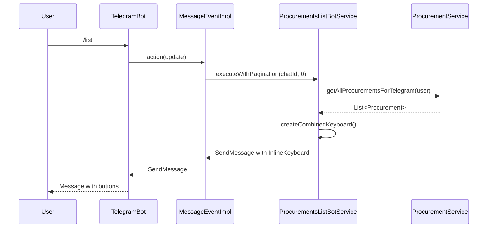
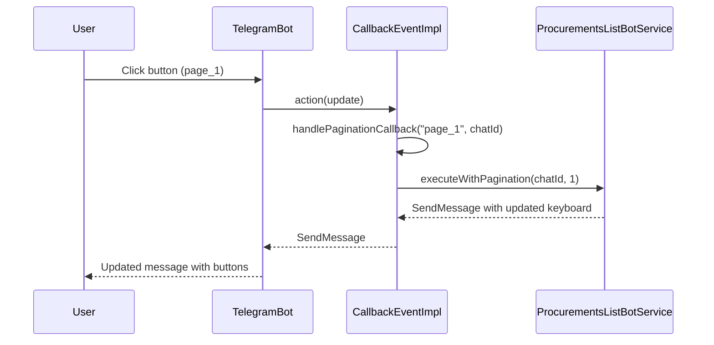

# Архитектура Telegram Bot - Техническая документация

## Общая архитектура

```
┌─────────────────┐    ┌──────────────────┐    ┌─────────────────┐
│   Telegram API  │◄──►│   TelegramBot    │◄──►│  Spring Context │
└─────────────────┘    └──────────────────┘    └─────────────────┘
                              │
                              ▼
                       ┌──────────────────┐
                       │  Event Handlers  │
                       └──────────────────┘
                              │
                    ┌─────────┴─────────┐
                    ▼                   ▼
            ┌──────────────┐    ┌──────────────┐
            │ MessageEvent │    │ CallbackEvent│
            └──────────────┘    └──────────────┘
                    │                   │
                    ▼                   ▼
            ┌──────────────┐    ┌──────────────┐
            │CommandHandler│    │Inline Buttons│
            └──────────────┘    └──────────────┘
```

## Компоненты системы

### 1. TelegramBot (Основной класс)

**Назначение**: Главный класс бота, обрабатывающий входящие обновления от Telegram API.

**Основные методы**:
- `onUpdateReceived(update: Update)` - обработка входящих обновлений
- `buildResponse(update: Update)` - построение ответа

**Особенности**:
- Поддержка дедупликации обновлений
- Логирование через middleware
- Обработка ошибок с fallback сообщениями

### 2. Event Handlers

#### MessageEventImpl
Обрабатывает текстовые сообщения и команды.

```kotlin
@Service
class MessageEventImpl(
    private val commandServices: Map<String, CommandHandler>,
    private val stateService: TelegramStateService,
    private val procurementsListService: ProcurementsListBotService
) : MessageEvent
```

**Обрабатываемые типы**:
- Команды (начинающиеся с `/`)
- Обычные сообщения
- Специальная обработка `/list`

#### CallbackEventImpl
Обрабатывает callback'ы от inline кнопок.

```kotlin
@Service
class CallbackEventImpl(
    private val procurementsListService: ProcurementsListBotService
) : CallbackEvent
```

**Обрабатываемые callback'ы**:
- `page_*` - пагинация
- `procurement_*` - детали закупки
- `filter_*` - фильтры
- `refresh` - обновление
- `back_to_list` - возврат к списку
- `delete_procurement_*` - удаление закупки

### 3. Command Handlers

Система обработчиков команд с поддержкой состояний.

```kotlin
interface CommandHandler {
    fun execute(chatId: Long, params: String): String
    fun getSupportedState(): SectionState
}
```

**Реализации**:
- `ProcurementsListBotService` - список закупок
- `StatsBotService` - статистика
- `HelpBotService` - справка
- `StartBotService` - стартовое меню

### 4. State Management

Управление состояниями пользователя для контекстной обработки команд.

```kotlin
enum class SectionState {
    ROOT,
    GIGACHAT,
    // другие состояния
}
```

## Поток обработки запросов

### Обработка команды /list



### Обработка callback'а



## Структура данных

### InlineKeyboardMarkup

```kotlin
data class InlineKeyboardMarkup(
    val keyboard: List<List<InlineKeyboardButton>>
)

data class InlineKeyboardButton(
    val text: String,
    val callbackData: String,
    val url: String? = null
)
```

### Структура callback данных

```
Префикс + Идентификатор
├── page_0          # Страница 0
├── page_1          # Страница 1
├── procurement_123 # Закупка с ID 123
├── filter_price    # Фильтр по цене
├── filter_date     # Фильтр по дате
├── refresh         # Обновление
├── back_to_list    # Возврат к списку
└── delete_procurement_123 # Удаление закупки 123
```

## Конфигурация и настройки

### Параметры пагинации

```kotlin
companion object {
    private const val ITEMS_PER_PAGE = 5  // Оптимальное количество для Telegram
}
```

### Форматирование сообщений

```kotlin
// Markdown поддержка
message.enableMarkdown(true)

// Эмодзи для визуального разделения
"📋 *Список закупок*"
"🔍 По цене"
"🔄 Обновить"
```

## Обработка ошибок

### Иерархия обработки

1. **TelegramBot** - общий обработчик ошибок
2. **Event Handlers** - специфичная обработка
3. **Command Handlers** - валидация входных данных

### Типичные сценарии

```kotlin
try {
    // Обработка запроса
} catch (e: TelegramApiException) {
    // Ошибки Telegram API
    middleware.logError(update, e, startTime)
    throw TelegramBotServiceException(eMessage, e)
} catch (e: Exception) {
    // Общие ошибки
    middleware.logError(update, e, startTime)
    // Отправка сообщения об ошибке пользователю
}
```

## Производительность

### Оптимизации

1. **Дедупликация обновлений**
   ```kotlin
   if (deduplicationService.isUpdateProcessed(updateId)) {
       return
   }
   deduplicationService.markAsProcessed(updateId)
   ```

2. **Кэширование пользователей**
   ```kotlin
   val user = telegramUserService.getNewOrSavedUserByTelegramId(chatId)
   ```

3. **Ограничение количества элементов**
   ```kotlin
   val limitedProcurements = procurements.take(maxItems)
   ```

### Мониторинг

```kotlin
// Логирование времени обработки
val startTime = LocalDateTime.now()
middleware.logRequest(update, startTime)
// ... обработка
middleware.logResponse(update, response.text, startTime)
```

## Безопасность

### Валидация входных данных

```kotlin
// Проверка ID
val procurementId = callbackData.removePrefix("procurement_").toLongOrNull()
if (procurementId == null) {
    return errorMessage("Неверный ID закупки")
}
```

### Проверка прав доступа

```kotlin
// Проверка принадлежности закупки пользователю
val user = telegramUserService.getNewOrSavedUserByTelegramId(chatId)
val procurement = procurementService.getById(procurementId)
if (procurement?.users?.contains(user) != true) {
    return errorMessage("Доступ запрещен")
}
```

## Тестирование

### Unit тесты

```kotlin
@Test
fun `should handle pagination correctly`() {
    val service = ProcurementsListBotService(mockUserService, mockProcurementService)
    val message = service.executeWithPagination(123L, 1)
    
    assertThat(message.replyMarkup).isInstanceOf(InlineKeyboardMarkup::class.java)
    assertThat(message.text).contains("страница 2")
}
```

### Интеграционные тесты

```kotlin
@Test
fun `should process callback and return response`() {
    val update = createCallbackUpdate("page_1")
    val response = callbackEvent.action(update)
    
    assertThat(response.text).contains("Список закупок")
    assertThat(response.replyMarkup).isNotNull()
}
```

## Расширение функциональности

### Добавление новой команды

1. Создать новый CommandHandler
2. Зарегистрировать в Spring контексте
3. Добавить обработку в MessageEventImpl

### Добавление новой кнопки

1. Создать обработчик в CallbackEventImpl
2. Добавить кнопку в клавиатуру
3. Обновить документацию

## Заключение

Архитектура Telegram бота построена с учетом принципов SOLID и обеспечивает:
- Модульность и расширяемость
- Легкость тестирования
- Простоту поддержки
- Высокую производительность

Система готова к масштабированию и добавлению новых функций.
